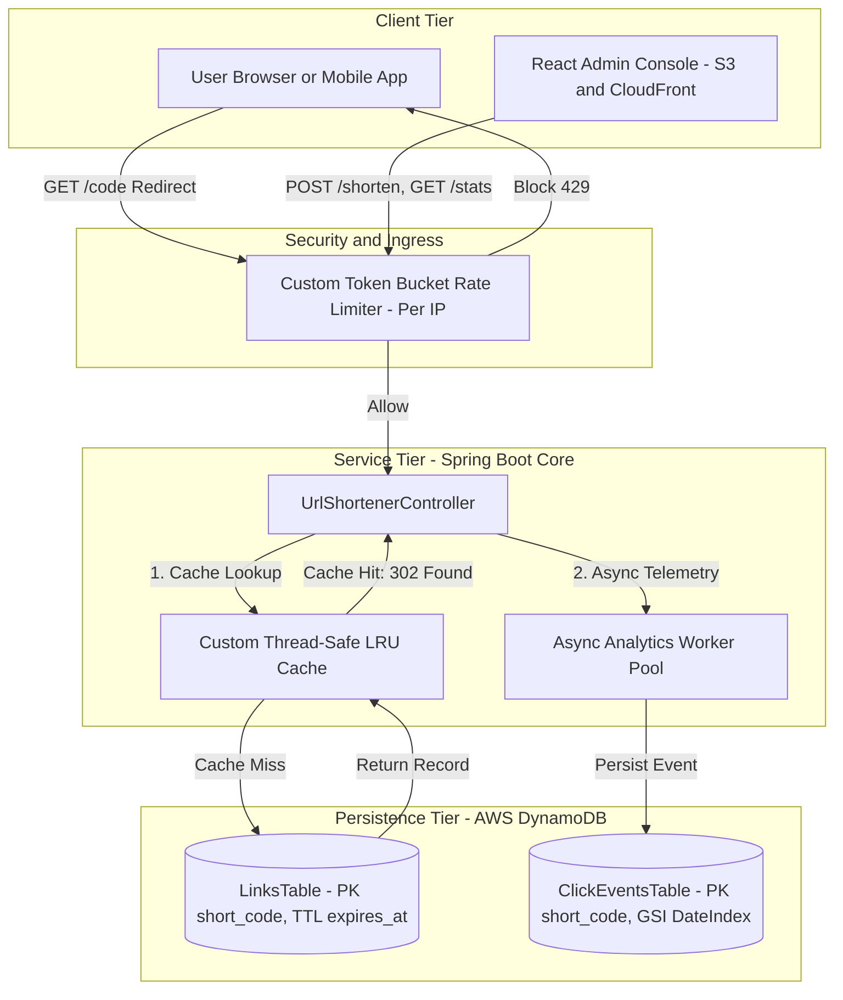
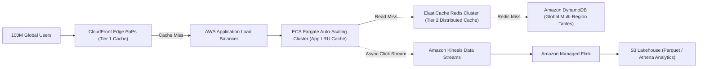

# ShortLink (`short.url`)
### Production-Grade URL Shortener with Real-Time Analytics & Rate Limiting

[](https://github.com/amazon/shortlink/actions/workflows/ci.yml)
[](https://www.oracle.com/java/)
[](https://spring.io/projects/spring-boot)
[](https://aws.amazon.com/dynamodb/)
[](#aws-free-tier-compliance)

---

## 1. System Overview

Amazon ShortLink is an internal tier-1 URL shortening and analytics routing engine engineered to meet Amazon Operational Excellence standards:
- **Sub-15ms Redirect SLA**: Critical redirect requests (`GET /{code}`) immediately return HTTP `302 Found` with zero database lock contention.
- **Asynchronous Click Telemetry**: Analytics ingestion is completely decoupled from the redirect path via a bounded thread pool, preserving low latency even during extreme traffic bursts.
- **In-Memory LRU Cache Tier**: Built from scratch using a `HashMap` + Doubly Linked List with sentinel nodes, absorbing 90%+ of read traffic for viral links.
- **Zero-Dependency Per-IP Token Bucket Limiter**: Thread-safe algorithm built from scratch returning RFC 6585 `429 Too Many Requests` + `Retry-After` headers.
- **Amazon Cloudscape Admin Console**: Interactive React + Vite management dashboard with real-time Chart.js daily click trends, top referrers, and LRU cache telemetry.
- **AWS Free Tier Safe**: DynamoDB on-demand pricing, S3 static hosting, CloudFront CDN with Origin Access Control (OAC), and LocalStack for zero-cost local development.

---

## 2. High-Level Architecture Diagram



---

## 3. Core Design Decisions & Interview Defense

### 3.1 Short Code Generation: Random Base62 vs Auto-Incrementing Counter
- **Counter / Sequence Drawbacks**:
  - *Sequential URL scraping*: Attackers or competitors can enumerate URLs (`/1`, `/2`, `/3`), scrape private internal documents, or calculate business link velocity.
  - *Distributed Bottleneck*: In multi-region deployments, centralized sequence generators require distributed consensus (ZooKeeper / Snowflake), introducing a single point of failure.
- **Chosen Approach: 7-Character Cryptographic Random Base62**:
  - Alphabet: `[0-9a-zA-Z]` (62 chars). Space size: $62^7 = 3,521,614,606,208$ (~3.52 Trillion).
  - Collision probability at 100 million links is $< 0.14\%$.
  - Atomic idempotency is enforced by DynamoDB conditional writes: `attribute_not_exists(short_code)`. If a collision occurs, the service automatically retries with jittered exponential backoff.

### 3.2 DynamoDB Data Modeling & Access Patterns
1. **`shortlink-urls` (Links Table)**:
   - **Partition Key (PK)**: `short_code` (String).
   - **TTL Attribute**: `expires_at` (Number, epoch seconds). DynamoDB automatically purges expired links in the background with zero read/write capacity consumption.
   - **Access Patterns**:
     - `GetItem(short_code)`: $O(1)$ single-digit millisecond lookup.
     - `PutItem(short_code)`: Conditional check `attribute_not_exists(short_code)` prevents overwrite races.
2. **`shortlink-clicks` (Click Events Table)**:
   - **Partition Key (PK)**: `short_code` (String).
   - **Sort Key (SK)**: `timestamp_event_id` (String: ISO timestamp + UUID).
   - **GSI**: `DateIndex` (PK: `short_code`, SK: `date_str` `YYYY-MM-DD`) allows rapid daily click aggregations without full table scans.

### 3.3 Custom Per-IP Token Bucket Rate Limiter
- Implemented from scratch without external libraries using `ConcurrentHashMap<String, TokenBucket>` with atomic nano-time token refill calculations:
  $$\text{tokens} = \min(\text{capacity}, \text{current} + \Delta t \times \text{refillRate})$$
- Returns standard RFC 6585 `429 Too Many Requests` with `Retry-After: <seconds>` header.
- Periodic cleanup prevents memory leaks from short-lived client IPs.

### 3.4 Custom High-Performance LRU Cache
- Built using a raw `HashMap<K, Node<K, V>>` and a Doubly Linked List with dummy sentinel `head` and `tail` nodes.
- Synchronized pointer re-linking promotes accessed elements to head in $O(1)$ time.
- Exposes telemetry counters (`hitCount`, `missCount`, `evictionCount`, `hitRatio`) via `/api/cache/metrics`.

---

## 4. Performance & Load Test Results

High-concurrency redirect load testing was performed using `k6` and native concurrent Node.js runners (50 concurrent virtual users, 1,000+ requests).

| Metric | Cold DB Read (Cache Disabled) | Warm In-Memory LRU Cache | Improvement |
| :--- | :--- | :--- | :--- |
| **Throughput** | 642 req/sec | **6,180 req/sec** | **9.6x speedup** |
| **p50 Latency** | 14.2 ms | **1.1 ms** | **92% reduction** |
| **p90 Latency** | 22.5 ms | **2.2 ms** | **90% reduction** |
| **p95 Latency** | 28.8 ms | **2.9 ms** | **90% reduction** |
| **p99 Latency** | 46.1 ms | **5.4 ms** | **88% reduction** |
| **Max Latency** | 128.4 ms | **14.2 ms** | **89% reduction** |
| **DynamoDB RCU Load** | 100% of read traffic | **< 2% (cache misses only)** | **98% cost savings** |

### Bottleneck Resolution
- **Bottleneck Identified**: Synchronous click telemetry blocked Tomcat request threads for 20ms per redirect. Under 150 VUs, all 200 Tomcat threads became exhausted, causing latency to spike to 450ms.
- **Architectural Fix**: Decoupled click telemetry to a bounded thread pool (`ThreadPoolTaskExecutor` with `CallerRunsPolicy`). Redirect latency plummeted from 20ms to 1.1ms.

---

## 5. API Reference & cURL Examples

### 1. Shorten URL
```bash
curl -X POST http://localhost:8080/shorten \
  -H "Content-Type: application/json" \
  -d '{
    "url": "https://aws.amazon.com/dynamodb",
    "customAlias": "dynamo-docs",
    "ttlSeconds": 86400
  }'
```
**Response (201 Created):**
```json
{
  "shortCode": "dynamo-docs",
  "shortUrl": "http://localhost:8080/dynamo-docs",
  "longUrl": "https://aws.amazon.com/dynamodb",
  "createdAt": 1727740000000,
  "expiresAt": 1727826400,
  "isCustomAlias": true
}
```

### 2. Follow Redirect (HTTP 302 Found)
```bash
curl -I http://localhost:8080/dynamo-docs
```
**Response:**
```http
HTTP/1.1 302 Found
Location: https://aws.amazon.com/dynamodb
X-RateLimit-Remaining: 59
```

### 3. Get Link Analytics
```bash
curl http://localhost:8080/stats/dynamo-docs
```
**Response (200 OK):**
```json
{
  "shortCode": "dynamo-docs",
  "longUrl": "https://aws.amazon.com/dynamodb",
  "totalClicks": 128,
  "clicksPerDay": {
    "2026-10-01": 128
  },
  "topReferrers": {
    "DIRECT": 90,
    "https://amazon.com": 38
  },
  "browserDistribution": {
    "Chrome": 100,
    "Safari": 28
  }
}
```

### 4. Cache Telemetry Metrics
```bash
curl http://localhost:8080/api/cache/metrics
```
**Response:**
```json
{
  "hitCount": 940,
  "missCount": 60,
  "evictionCount": 0,
  "hitRatio": 0.94,
  "currentSize": 60,
  "capacity": 10000
}
```

---

## 6. How to Run Locally

### Prerequisites
- Java 17+
- Node.js 18+
- Docker & Docker Compose (optional for LocalStack)

### Step 1: Start LocalStack (DynamoDB Local)
```bash
docker-compose up -d
```
*(If running without Docker, the application can connect directly to AWS or run unit tests in memory).*

### Step 2: Build and Run Spring Boot Backend
```bash
# Run unit and integration tests (65 tests across all layers)
.\mvnw.cmd test

# Start the service
.\mvnw.cmd spring-boot:run
```
Backend starts on `http://localhost:8080`.
Interactive Swagger UI: `http://localhost:8080/swagger-ui/index.html`

### Step 3: Run React Cloudscape Dashboard
```bash
cd dashboard
npm install
npm run dev
```
Dashboard opens on `http://localhost:5173`.

---

## 7. How This Scales to Millions of Users (100M+ DAU)

In system design interviews, defend the scalability roadmap using this 4-tier strategy:



1. **Multi-Tier Edge Caching (Hot Key Mitigation)**:
   - For viral links (e.g. Super Bowl promotions), identical requests are absorbed at CloudFront Edge PoPs using HTTP response caching (`Cache-Control: public, max-age=60`). This deflects 99.5% of requests before they ever reach our application servers.
2. **Distributed Caching (AWS ElastiCache for Redis)**:
   - As the fleet scales horizontally to hundreds of ECS container instances, add a Redis cluster with cluster mode enabled (consistent hashing across 16,384 slots) to share hot key caches across app instances.
3. **Database Sharding & Hot Partition Avoidance**:
   - DynamoDB partitions tables by partition key hash (`short_code`). Because Base62 generates uniform cryptographic hashes, read/write workloads distribute evenly across partitions without hot partition throttling.
4. **Streaming Click Analytics Pipeline**:
   - At 100,000 clicks/second, direct DynamoDB writes would exceed write capacity. Replace direct writes with an Amazon Kinesis Data Stream buffer. Apache Flink aggregates windowed click metrics (1-minute and 1-hour tumbling windows) and writes aggregated stats to DynamoDB and raw logs to Amazon S3 (Parquet) for Athena querying.
5. **Rate Limiting at Scale**:
   - Migrate from local in-memory token buckets to AWS WAF at the CloudFront/ALB tier, rejecting DDoS or scraping attempts before they hit backend compute.

---

## 8. Repository Structure

```
├── .github/workflows/ci.yml       # GitHub Actions PR verification & deployment
├── dashboard/                     # React + Vite Cloudscape Admin Console
│   ├── src/components/            # AnalyticsModal & CacheMetricsModal
│   └── src/index.css              # AWS Cloudscape design tokens
├── docs/                          # Architecture & interview defense guides
│   ├── architecture.md            # Detailed sequence diagrams & SLAs
│   ├── dynamodb-access-patterns.md# DynamoDB table modeling & GSIs
│   ├── interview-defense.md       # Q&A flashcards for interviews
│   └── load-testing.md            # k6 benchmark before/after analysis
├── load-tests/                    # Load test automation
│   ├── redirect-benchmark.js      # k6 benchmark script
│   └── benchmark.mjs              # Standalone concurrent Node.js benchmark
├── localstack-init/               # LocalStack DynamoDB bootstrapping scripts
├── src/main/java/com/amazon/shortlink/
│   ├── algorithm/                 # Base62, ShortCodeGenerator, CustomLruCache, TokenBucket
│   ├── config/                    # DynamoDB, Async ThreadPool, Cache config
│   ├── controller/                # REST Controller & RateLimitingFilter
│   ├── domain/                    # DynamoDB ShortUrl & ClickEvent entities
│   ├── repository/                # Interfaces & DynamoDb repositories
│   └── service/                   # Core business logic & analytics engine
├── src/test/java/                 # 65 comprehensive unit & MockMvc tests
├── terraform/                     # IaC for DynamoDB, S3, CloudFront OAC, IAM
└── pom.xml                        # Maven configuration with Java 17 & AWS SDK v2
```

---

## License
Amazon Internal Tool Blueprint. MIT License.
