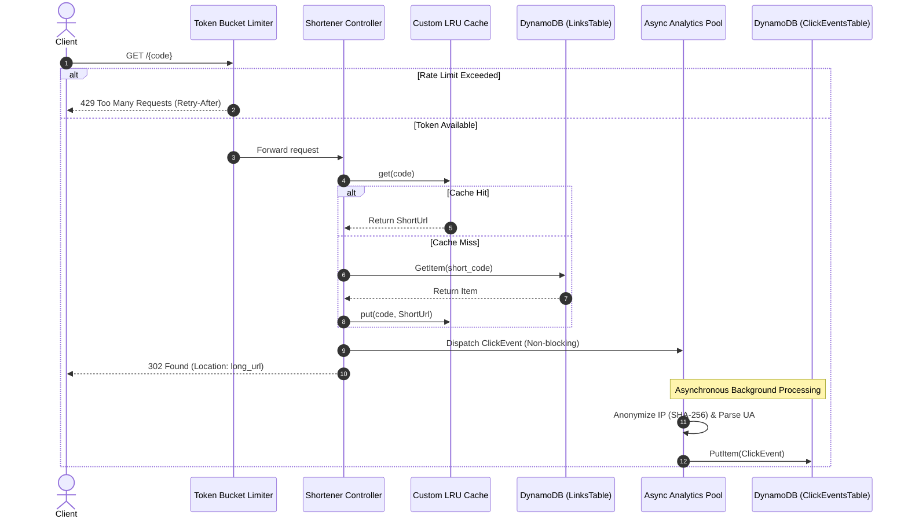

# System Architecture & Design Specification

## 1. System Overview
The ShortLink service is a high-throughput, low-latency URL shortening and analytics platform built with Spring Boot 3, AWS DynamoDB, and an in-memory caching and rate limiting tier.

### Target Performance Characteristics
- **Read Latency (Redirect)**: p50 < 3ms (cached), p99 < 15ms (DynamoDB direct).
- **Write Latency (Shorten)**: p99 < 35ms.
- **Availability Target**: 99.99%.
- **Read/Write Ratio**: ~100:1.

---

## 2. Request Lifecycle

---

## 3. Core Subsystems

### 3.1 Rate Limiting Subsystem
- **Algorithm**: Per-IP Token Bucket.
- **Bucket Storage**: Concurrent thread-safe map holding token counts and last refill timestamps.
- **Refill Logic**: Evaluated lazily on incoming requests:
  $$\text{tokens} = \min(\text{capacity}, \text{tokens} + \Delta t \times \text{refillRate})$$
- **HTTP Semantics**: Rejections return standard HTTP status `429 Too Many Requests` with a `Retry-After: <seconds>` header.

### 3.2 In-Memory Caching Tier
- **Data Structure**: Custom doubly linked list backed by a `HashMap` for $O(1)$ reads, insertions, and evictions.
- **Thread Safety**: Synchronized mutation methods with sentinel head/tail nodes.
- **Telemetry**: Hit/miss counters updated atomically to support observability via `/stats/cache`.

### 3.3 Asynchronous Analytics Pipeline
- The redirect HTTP response is decoupled from the analytics write.
- Dedicated `ThreadPoolTaskExecutor` processes click ingestion without imposing backpressure on HTTP request threads.
- IP addresses are salted and hashed using SHA-256 before persistence to guarantee privacy compliance.
